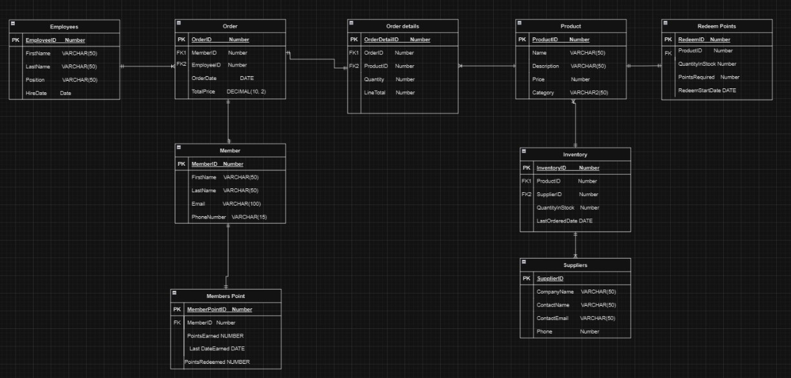

---

# ☕ Café Management Database System

### SQL | Relational Database Design | Data Analytics | ER Modeling

---

## 📖 Project Overview

This project implements a **relational database system for managing the operations of a local café**. The system replaces manual bookkeeping with a centralized database that efficiently stores and manages information related to **employees, customers, products, suppliers, inventory, and sales transactions**.

The database allows café managers to track operational data and generate reports that support **data-driven decision making**.

---

## 🎯 Problem Statement

Many small cafés rely on **manual systems** to track daily operations such as inventory, sales transactions, and employee records. These processes are **time-consuming and prone to errors**.

Without structured data storage, it becomes difficult to analyze:

* Customer purchasing behavior
* Product popularity
* Sales trends
* Inventory levels

This project addresses these challenges by creating a **centralized relational database** that organizes and analyzes café data.

---

## 💡 Solution

The project introduces a **centralized SQL database** that automates the storage and management of café operations.

The system enables:

* Efficient **inventory management**
* Employee and supplier **record tracking**
* Automated storage of **sales transactions**
* **Customer loyalty points** tracking
* Data analysis through **SQL reports**

This approach improves operational efficiency while providing insights into **business performance and decision making**.

---

## 🏗 Database Design

### Main Tables

| Table        | Description                      |
| ------------ | -------------------------------- |
| Employees    | Stores employee information      |
| Members      | Customer membership information  |
| Products     | Café menu items                  |
| Suppliers    | Product suppliers                |
| Inventory    | Tracks stock levels              |
| Orders       | Customer transactions            |
| OrderDetails | Products included in each order  |
| MembersPoint | Customer loyalty points          |
| RedeemPoints | Products redeemable using points |

---

## 🔗 Entity Relationship Diagram

The ER diagram illustrates relationships between **employees, customers, orders, products, and inventory**, ensuring consistent and normalized data storage.


```markdown
!
```

---

## 🧮 Database Normalization

Normalization techniques were applied to organize the database structure and **reduce redundancy**.

Key benefits include:

* Eliminating **duplicate data**
* Improving **data consistency**
* Creating efficient **relationships between tables**

This resulted in a **scalable database structure** capable of supporting detailed reporting and analysis.

---

## 📊 Example SQL Reports

### Top Selling Products

```sql
SELECT p.Name, COUNT(od.ProductID) AS TotalSales
FROM Products p
LEFT JOIN OrderDetails od ON p.ProductID = od.ProductID
GROUP BY p.ProductID, p.Name
ORDER BY TotalSales DESC;
```

---

### Monthly Sales Trend

```sql
SELECT TO_CHAR(o.OrderDate, 'YYYY-MM') AS Month,
       SUM(o.TotalPrice) AS MonthlySales
FROM Orders o
GROUP BY TO_CHAR(o.OrderDate, 'YYYY-MM')
ORDER BY Month;
```

---

### Inventory Status Report

```sql
SELECT 
p.Name AS ProductName,
i.QuantityInStock,
s.CompanyName AS Supplier,
i.LastOrderedDate
FROM Inventory i
JOIN Products p ON i.ProductID = p.ProductID
JOIN Suppliers s ON i.SupplierID = s.SupplierID;
```

These reports help identify **product trends, monitor inventory levels, and analyze business performance**.

---

## 📂 Project Structure

```
cafe-management-database
│
├── database
│   ├── schema.sql
│   ├── insert_data.sql
│   └── reports.sql
│
├── docs
│   └── ERD.png
│
└── README.md
```

---

## 🚀 How to Run the Project

### 1️⃣ Create the database tables

```
schema.sql
```

### 2️⃣ Insert sample data

```
insert_data.sql
```

### 3️⃣ Run analytics reports

```
reports.sql
```

---

## 📈 Business Insights

The SQL reports allow the café to analyze operational performance by identifying:

* **Best-selling products**
* **Monthly sales trends**
* **Product category performance**
* **Inventory levels requiring restocking**

These insights help optimize **inventory management and business strategy**.

---

## 🔮 Future Improvements

Future Enhancements:

* Reservation system for customers
* Employee scheduling and performance tracking
* Special promotions or seasonal menu items
* Sales analytics table for long-term reporting

---

## 🛠 Technologies Used

* **SQL**
* **Oracle SQL Developer**
* **Relational Database Design**
* **Entity Relationship Modeling**
* **Database Normalization**

---
